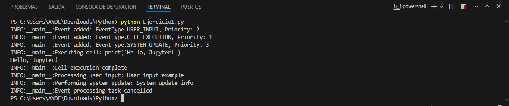
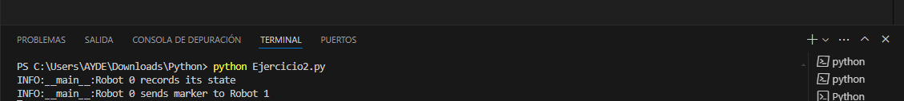
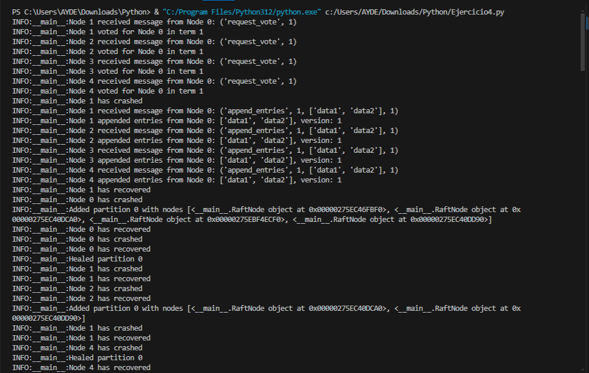
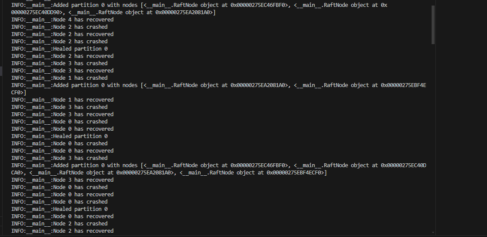
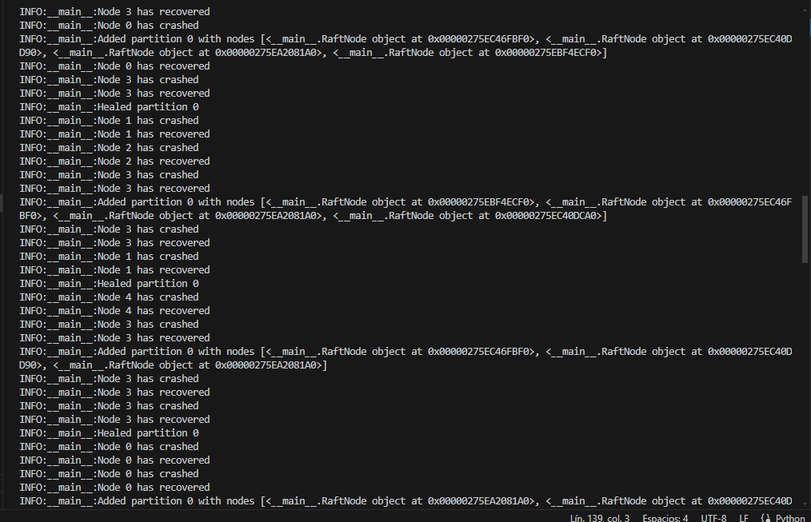

**Ejercicio** **1:**

En el código se han utilizado varios módulos y funciones de Python para
implementar un sistema de eventos asíncrono simulado y que los
siguientes.

> ● **Asyncio:** Es el módulo principal para soportar programación
> asíncrona en Python. Permite la ejecución concurrente de tareas sin
> necesidad de hilos explícitos.
>
> ● **Logging:** Módulo estándar de Python para registrar mensajes de
> diversos niveles como DEBUG, INFO, ERROR, etc. Ayuda a monitorear y
> depurar la aplicación.
>
> ● **Queue:** Proporciona estructuras de datos para colas, en este caso
> PriorityQueue, que es una cola donde los elementos se recuperan en
> orden de prioridad.
>
> ● **Threading:** Permite el manejo de hilos en Python. Se utiliza aquí
> para sincronizar el acceso a la cola de eventos mediante un objeto de
> bloqueo (Lock).
>
> ● **Concurrent.futures.ThreadPoolExecutor:** Un ejecutor de hilos que
> permite ejecutar tareas en hilos separados. Es útil para ejecutar
> operaciones que bloquean en un entorno asíncrono sin bloquear el bucle
> de eventos de asyncio.
>
> ● **Enum.Enum:** Se utiliza para definir EventType, una enumeración
> que representa diferentes tipos de eventos en el sistema.
>
> ● **Nest_asyncio:** Es utilizado para anular la política de asyncio en
> entornos de notebooks, permitiendo ejecutar código asíncrono dentro de
> estos entornos sin problemas.

En cuanto a las funciones y clases específicas del código son los
siguientes:

> ● **Event:** Representa un evento con un tipo, datos asociados y una
> prioridad en la cola.
>
> ● **EventSystem:** Implementa un sistema de manejo de eventos con
> métodos para agregar eventos, procesar eventos de manera asíncrona y
> ejecutar acciones asociadas a cada tipo de evento.
>
> ● **NotebookSimulator:** Simula un entorno interactivo tipo
> "notebook", donde se agregan eventos como entrada de usuario,
> ejecución de celdas y actualización del sistema.
>
> ● **run():** Método asíncrono que inicia el procesamiento de eventos,
> agrega eventos simulados y luego cancela la tarea de procesamiento
> después de un período de simulación.

Por lo tanto, en este código se utiliza asyncio junto con otros módulos
estándar para crear un sistema de eventos asíncrono simulado, útil para
aplicaciones que requieren manejo concurrente de tareas y eventos
prioritarios. Además cada componente en este código

cumple un papel crucial para crear un sistema robusto de manejo de
eventos asíncronos, simulando un entorno de notebook donde los eventos
son priorizados y procesados según su importancia y tipo.

**Resultados:**

> **1.** **Se** **agrega** **eventos** **a** **la** **cola:**
>
> **INFO:\_\_main\_\_:Event** **added:** **EventType.USER_INPUT,**
> **Priority:** **2** **INFO:\_\_main\_\_:Event** **added:**
> **EventType.CELL_EXECUTION,** **Priority:** **1**
> **INFO:\_\_main\_\_:Event** **added:** **EventType.SYSTEM_UPDATE,**
> **Priority:** **3**
>
> ● Estos logs indican que se han añadido eventos a la cola de eventos
> **PriorityQueue** del sistema. Cada evento tiene un tipo
> (**EventType.USER_INPUT,** **EventType.CELL_EXECUTION,**
> **EventType.SYSTEM_UPDATE**) y una prioridad asignada (2, 1, 3
> respectivamente).
>
> ● **Prioridad:** La prioridad es utilizada para determinar el orden en
> que se procesarán los eventos; los eventos con menor valor de
> prioridad se procesan primero.
>
> 2\. **Ejecutar** **la** **celda**:
>
> **INFO:\_\_main\_\_:Executing** **cell:** **print('Hello,**
> **Jupyter!')** **Hello,** **Jupyter!**
>
> **INFO:\_\_main\_\_:Cell** **execution** **complete**
>
> ● **INFO:\_\_main\_\_:Executing** **cell:** **print('Hello,**
> **Jupyter!'**): Este log señala que el sistema de eventos ha comenzado
> a procesar un evento de tipo **CELL_EXECUTION** ejecutando el código
> **print('Hello,** **Jupyter!')**.
>
> ● **Hello,** **Jupyter!:** Este es el resultado de la ejecución del
> código. **print('Hello,** **Jupyter!')** imprime la cadena **Hello,**
> **Jupyter!** en la salida estándar.
>
> ● **INFO:\_\_main\_\_:Cell** **execution** **complete:** Este log
> indica que la ejecución del código de la celda se ha completado
> exitosamente.
>
> 3\. **Procesar** **entrada** **del** **usuario** **y**
> **actualización** **del** **sistema**:
>
> **INFO:\_\_main\_\_:Processing** **user** **input:** **User**
> **input** **example** **INFO:\_\_main\_\_:Performing** **system**
> **update:** **System** **update** **info**
>
> ● **INFO:\_\_main\_\_:Processing** **user** **input:** **User**
> **input** **example:** Este log indica que el sistema de eventos está
> procesando un evento de tipo **USER_INPUT** con los datos **User**
> **input** **example**.
>
> ● **INFO:\_\_main\_\_:Performing** **system** **update:** System
> update info: Este log indica que el sistema de eventos está procesando
> un evento de tipo **SYSTEM_UPDATE** con los datos **System**
> **update** **info**.
>
> ● **Procesamiento** **de** **eventos**: Estos logs muestran que el
> sistema está manejando correctamente diferentes tipos de eventos y
> ejecutando las acciones asociadas a cada uno de ellos
>
> 4\. **Cancelación** **de** **la** **tarea** **de** **procesamiento**
> **de** **eventos**:
>
> **INFO:\_\_main\_\_:Event** **processing** **task** **cancelled**
>
> ● Este log indica que la tarea asíncrona **process_events**, que
> estaba continuamente revisando y procesando la cola de eventos, ha
> sido cancelada.
>
> ● **Cancelación** **ordenada**: Al cancelar esta tarea, el sistema
> asegura que todos los eventos han sido procesados o se está deteniendo
> de manera controlada. El manejo de la excepción **CancelledError**
> previene que queden tareas pendientes o en un estado inconsistente.

**Resultado** **general:**

> 1\. **Sistema** **de** **Eventos** **Funcional**: El sistema de
> eventos está funcionando correctamente, añadiendo, procesando y
> finalizando eventos de manera ordenada y en base a prioridades.
>
> 2\. **Ejecución** **Asíncrona**: Utiliza procesamiento asíncrono
> (asyncio) para manejar eventos concurrentemente sin bloquear el flujo
> de ejecución.
>
> 3\. **Manejo** **de** **Prioridades**: Los eventos se procesan en el
> orden correcto de acuerdo a sus prioridades asignadas.
>
> 4\. **Logging** **Informativo**: Los logs proporcionan una traza clara
> y detallada de las acciones que se están realizando, facilitando la
> supervisión y el debugging del sistema.
>
> 5\. **Finalización** **Controlada**: El sistema se cierra de manera
> controlada, asegurando que no haya tareas pendientes ni eventos no
> procesados.

Por lo tanto, el sistema de eventos asíncrono funcionó correctamente,
procesando eventos en orden de prioridad y finalizando de manera
controlada.

**Ejercicio** **2:**

**Robot.receive_token()**, se usa en el contexto del algoritmo de
Raymond para exclusión mutua distribuida.

En el método **receive_token()** de la clase **RobotRaymond** (o
**FullRobot** en tu implementación), cuando un robot recibe un token, se
ejecutan una serie de acciones:

> ● Asignación del Token: El robot actual se convierte en el propietario
> del token, lo cual significa que tiene el derecho de entrar a la
> sección crítica si lo necesita.
>
> ● Desencolar Solicitud: Si hay otros robots en la cola de solicitudes
> (request_queue), se toma al próximo robot en la cola.
>
> ● Envío del Token: Se envía el token al próximo robot en la cola de
> solicitudes, permitiéndole a ese robot entrar a la sección crítica
> cuando lo necesite.

Es decir, **robot.receive_token()** es crucial para gestionar el paso
del token entre los robots que están en espera de entrar a la sección
crítica en un sistema de exclusión mutua distribuida, asegurando que
solo un robot a la vez pueda ejecutar la sección crítica.

Los mas importantes del codigo son lo siguiente:

> 1\. Snapshot (Chandy-Lamport): La implementación de la captura de
> snapshot con marcadores parece estar bien estructurada. Los métodos
> **initiate_snapshot()** y **receive_marker()** están correctamente
> diseñados para iniciar un snapshot y manejar los marcadores entre los
> robots.
>
> 2\. Exclusión Mutua (Algoritmo de Raymond): Los métodos
> **request_resource()**, **receive_request()**, y **receive_token()**
> son cruciales para gestionar la exclusión mutua distribuida. Están
> diseñados para permitir que los robots soliciten y reciban tokens para
> controlar el acceso a una sección crítica.
>
> 3\. Relojes Vectoriales: La implementación de VectorClock y
> RobotVector parece adecuada para gestionar relojes vectoriales y
> sincronización de eventos en un entorno distribuido, lo cual es
> esencial para el ordenamiento parcial de eventos.
>
> 4\. Recolector de Basura Generacional: GenerationalGarbageCollector
> está implementado para gestionar la memoria y la recolección de basura
> basada en generaciones, lo cual es importante para la eficiencia en
> sistemas distribuidos.
>
> 5\. Integración en FullRobot: La clase FullRobot integra todas las
> funcionalidades anteriores, lo cual permite simular el comportamiento
> completo de un robot en un

> sistema distribuido. El método perform_task() muestra cómo se ejecutan
> tareas críticas y se gestionan recursos de manera segura y eficiente.

**Resultado:**

> ● **Robot** **0** **records** **its** **state:** Esto indica que el
> Robot 0 ha registrado su estado actual como parte del proceso de
> captura de instantáneas (snapshots). En el contexto de algoritmos
> distribuidos como el de Chandy-Lamport para captura de instantáneas
> globales, esto generalmente implica que el robot ha registrado la
> información necesaria para reconstruir su estado en un punto
> específico en el tiempo.
>
> ● **Robot** **0** **sends** **marker** **to** **Robot** **1:** Esto
> indica que el Robot 0 ha enviado un marcador (marker) al Robot 1. En
> el contexto de algoritmos de captura de instantáneas, un marcador es
> un mensaje especial que se utiliza para iniciar o señalar el proceso
> de captura de instantáneas. Cuando un robot envía un marcador a otro
> robot, está señalando que ha comenzado el proceso de captura de
> instantáneas y que el robot receptor debe responder apropiadamente
> según el algoritmo implementado.

Es decir, estos mensajes indican que el Robot 0 ha iniciado la captura
de instantáneas (mediante la grabación de su estado) y ha enviado un
marcador al Robot 1 para informarle de este inicio. Esto es fundamental
en los sistemas distribuidos para coordinar y registrar el estado global
de manera consistente en un momento dado.

**Ejercicio** **4**

> 1\. Importaciones y Configuración:
>
> ● Se importan los módulos necesarios como asyncio para la programación
> asíncrona, random para la generación de números aleatorios, logging
> para los registros y defaultdict de collections para manejar las
> particiones de red.
>
> ● Se configura el registro (logging) para mostrar mensajes
> informativos.
>
> 2\. Clase NetworkPartition:
>
> ● Gestiona las particiones de red entre nodos.
>
> ● is_partitioned: Verifica si dos nodos están en la misma partición. ●
> add_partition: Añade una nueva partición de nodos.
>
> ● heal_partition: Elimina una partición existente para simular la
> curación de una división de red.
>
> 3\. Enum NodeStatus:
>
> ● Define los estados posibles de un nodo: UP (activo) y DOWN
> (inactivo).
>
> 4\. Clase RaftNode:
>
> ● Representa un nodo en el sistema Raft.
>
> ● Gestiona su estado (status), red (network), lista de nodos (nodes),
> término actual (term), voto otorgado (voted_for), registro de
> operaciones (log), índice de compromiso (commit_index), y versión de
> datos (data_version).
>
> ● Métodos clave:
>
> send_message y receive_message: Simulan el envío y recepción de
> mensajes entre nodos.
>
> start_election: Inicia una elección de líder entre los nodos.
> append_entries: Añade entradas al registro y las replica en otros
> nodos.
>
> handle_vote_request y handle_append_entries: Procesan solicitudes de
> voto y entradas de registro respectivamente.
>
> crash y recover: Simulan el fallo y recuperación de un nodo.
>
> 5\. Funciones simulate_raft, simulate_failures y
> simulate_network_partitions:
>
> ● simulate_raft: Simula el proceso Raft, iniciando elecciones y
> añadiendo entradas al registro.
>
> ● simulate_failures: Simula fallos y recuperaciones aleatorios de
> nodos.
>
> ● simulate_network_partitions: Simula la creación y curación de
> particiones de red entre nodos.
>
> 6\. Función main:
>
> ● Utiliza asyncio.gather para ejecutar concurrentemente las
> simulaciones de Raft, fallos de nodos y particiones de red.

Es decir, este código simula un entorno distribuido donde los nodos Raft
compiten por la elección de líder, replican entradas de registro para
mantener la consistencia, y manejan fallos y particiones de red para
demostrar la robustez del algoritmo frente a condiciones adversas. Cada
componente está diseñado para simular comportamientos específicos del
algoritmo Raft y condiciones de red que pueden ocurrir en sistemas
distribuidos reales.

**Resultado:**

Este registro muestra una simulación del algoritmo Raft, utilizado para
la tolerancia a fallos en sistemas distribuidos. Aquí hay algunas
observaciones clave basadas en los registros:

> 1\. Inicio del proceso:
>
> ● Los nodos (Node 1, Node 2, Node 3, Node 4) comienzan con un proceso
> de elección de líder (request_vote), donde se vota por un líder para
> un término específico (term1).
>
> 2\. Recuperación de fallas:
>
> ● Node 1 experimenta un fallo y luego se recupera. Esto se indica
> cuando un nodo deja de responder (crashed) y luego vuelve a estar
> disponible (recovered).
>
> ● Similarmente, otros nodos (Node 0, Node 2, Node 3, Node 4) también
> experimentan fallas temporales y se recuperan posteriormente.
>
> 3\. Particiones y curación:
>
> ● La red se divide en particiones temporales (particiones 0), donde
> algunos nodos quedan separados del resto debido a fallos o problemas
> de conectividad.
>
> ● Las particiones se curan cuando los nodos vuelven a estar
> disponibles y la red se restaura a un estado donde todos los nodos
> pueden comunicarse entre sí.
>
> 4\. Procesamiento de entradas (append_entries):
>
> ● Durante el funcionamiento normal, los nodos procesan entradas (como
> \['data1', 'data2'\]) enviadas por el líder (Node 0 en este caso para
> term 1).
>
> ● Cada nodo registra las entradas que ha procesado, lo que indica que
> la replicación de datos está ocurriendo correctamente dentro del
> clúster de nodos.
>
> 5\. En este caso el significado técnico:
>
> ● En términos técnicos, este registro muestra cómo Raft maneja la
> elección de líder, la replicación de entradas de registro y la
> recuperación de fallas en un entorno distribuido.
>
> ● La curación de particiones es esencial para garantizar que el
> sistema vuelva a un estado coherente y que la replicación de datos
> pueda continuar sin interrupciones.

Por lo tanto, este registro es un ejemplo de cómo Raft gestiona la
disponibilidad y la consistencia en un sistema distribuido, asegurando
que los datos estén replicados y que la red pueda recuperarse de fallos
y particiones de manera efectiva.
